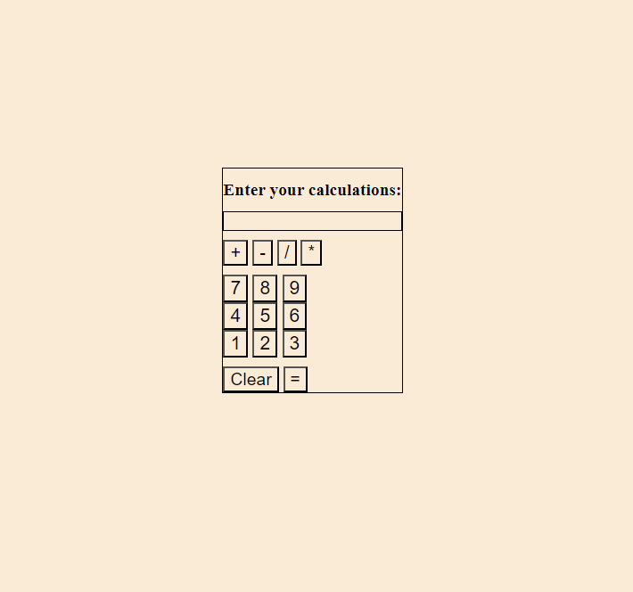

# Calculator-app

## Description
User will be able to click any number and/or operator and have the display update with each clicked button. Once finished, user will be able to submit and get the answer of the math equation displayed.

## Screenshot

## Link
Github- https://github.com/Ali-Aldawoodi/Calculator-app
